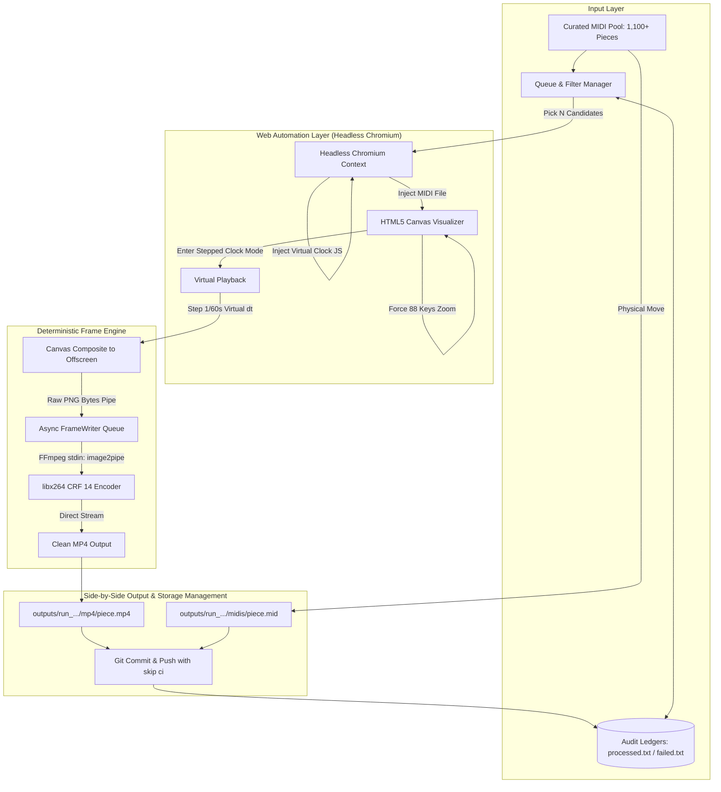

# Architecture & Technical Design Decisions

## 1. Overview & High-Level Architecture

**PianoFall** is an automated, offline rendering pipeline designed to render high-definition (1920×1200 @ 60 FPS), silent, falling-notes piano visualization videos from MIDI files on standard CPU runners.



---

## 2. Core Technical Decisions & Rationale

### A. Deterministic Headless Frame-Stepping vs. Real-Time Screen Capture
* **The Problem**: In real-time screen capture (e.g. `x11grab` inside Xvfb), the browser runs inside an OS window. The window manager and browser display navigation tabs, URL bars, and desktop margins in the recording. Furthermore, CPU load causes variable frame drops and timing drift, requiring complex `setpts` retiming passes that duplicate frames and reduce motion clarity.
* **The Solution**: **In-Page Canvas Compositing + Virtual Audio Clock**:
  1. Chromium runs fully `--headless=new` with zero OS window decorations, tabs, or address bars.
  2. `DETERMINISTIC_CLOCK_JS` patches `AudioContext.currentTime`, `requestAnimationFrame`, and `performance.now()`. Time only advances when Python explicitly commands it.
  3. For every frame, `window.__captureThenStep(1/60)` composites all visible `<canvas>` layers directly onto an offscreen canvas and advances time by exactly 16.67ms.
  4. Captured frames are streamed directly to FFmpeg stdin via `image2pipe`.
  5. The result is 100% time-synchronized 1× playback speed at true 60 FPS with zero dropped frames and zero retiming.

### B. Full 88-Key Piano Keyboard Enforcement
* **The Problem**: Default visualizer behavior scales or crops the piano keyboard to the note range of the song or viewport width, often cutting off keys or showing only 61/76 keys.
* **The Solution**:
  1. The pipeline triggers the visualizer's internal `#showAllButton` / `window.S().showAll()` routine immediately after loading the song.
  2. Injected CSS hides navigation bars, floating zoom buttons, and chevrons, with full-bleed viewport CSS (`100vw`, `100vh`, `#000` background).
  3. A synthetic window `resize` event is fired to force the canvas engine to recalculate key coordinates edge-to-edge.

### C. Batch Quota Enforcement & 5-Hour Runner Safeguard
* **The Problem**: GitHub Actions standard runners enforce a 6-hour job timeout. Running indefinitely risks ungraceful runner termination without committing rendered videos.
* **The Solution**:
  1. Batch size is strictly bounded to the requested target (default: **30 videos**).
  2. The runner monitors elapsed execution time. When time exceeds 4.5 hours (or upon entering the 5th hour), the current piece being processed is marked as the final piece of the run.
  3. The workflow commits and pushes all completed outputs and ledgers cleanly.
  4. If the 30-video quota has not yet been satisfied, the workflow automatically dispatches a continuation run (`gh workflow run render.yml -f target_videos=$REMAINING -f clean_previous=false`), continuing until all 30 videos are finished, whereupon it completely shuts down.

### D. Side-by-Side MP4 and MIDI Organization
* **The Problem**: Disconnected video and MIDI files make downstream management, tagging, and player integration difficult.
* **The Solution**:
  Each execution batch produces a dedicated run directory:
  ```text
  outputs/run_YYYY-MM-DD_HHMMSS/
    ├── mp4/
    │     └── <piece_stem>.mp4
    └── midis/
          └── <piece_stem>.mid
  ```
  Both files share identical basenames and are co-located in parallel directories for direct desktop application synchronization.

### E. Physical Pool Movement for Zero Duplicate Guarantee
* **The Problem**: Depending solely on in-memory state or filenames can lead to duplicate renders if file names vary or logs are cleared.
* **The Solution**:
  1. 1,100+ curated classical pieces from the ByteDance GiantMIDI-Piano archive reside in `midis_pool/`.
  2. When a piece is selected and successfully rendered, its `.mid` file is physically moved out of `midis_pool/` and placed into `outputs/<run>/midis/`.
  3. In addition, its completion is appended to `data/processed_midis.txt` and `data/render_history.csv`.
  4. A piece can physically never be re-selected from `midis_pool/`.

### F. Automated Storage Management & Audit Trail
* **The Problem**: Keeping hundreds of MP4 videos inside a Git repository permanently bloats the `.git` packfiles.
* **The Solution**:
  1. On each new manual batch render, previous outputs can be automatically cleaned (`clean_previous=true`).
  2. Before deletion, every asset's metadata (file name, type, size in bytes/MB, duration, rendered timestamp) is permanently logged into `data/deletion_history.csv` and `data/cleanup_log.md`.
  3. Previous outputs are removed, ensuring the repository stays lightweight while keeping a complete historical audit record.
