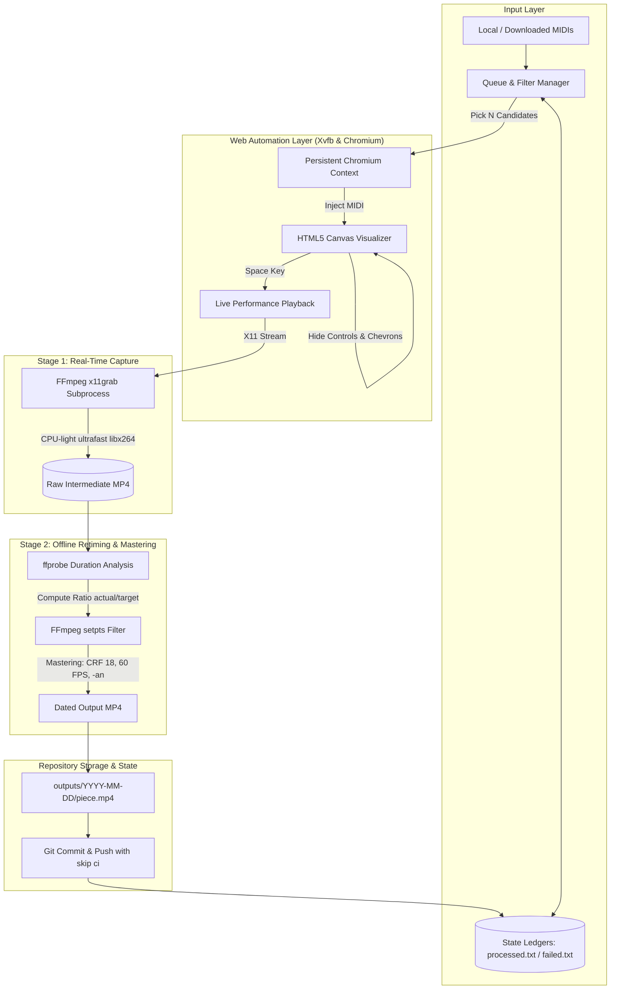

# Architecture & Technical Design Decisions

## 1. Overview & High-Level Architecture

**PianoFall** is an automated, zero-human-interaction pipeline designed to render high-definition (1920×1200), silent, falling-notes piano visualization videos from MIDI files using pure CPU execution on free GitHub-hosted Linux runners.

---

## 2. Core Technical Decisions & Rationale

### A. Pure-CPU Execution on 4-vCPU Runners
* **Problem**: Standard free GitHub-hosted Linux runners provide 4 vCPUs and 16 GB of RAM, but **no GPU** acceleration or hardware encoders (no NVENC, QuickSync, or VA-API). Naively rendering 1920×1200 WebGL/Canvas2D in real time while simultaneously running high-quality video encoding will completely saturate all CPU cores, causing dropped browser frames, timing jitter, and rendering stutter.
* **Solution**: A **two-stage decoupled pipeline**:
  1. **Stage 1 (Live Screen Capture)**: Playwright drives Chromium with `--use-gl=swiftshader` inside an Xvfb virtual frame-buffer (`:99`). During playback, FFmpeg captures the display via `x11grab` at 30 FPS using `libx264 -preset ultrafast -crf 17`. The `ultrafast` preset consumes minimal CPU overhead (<15%), leaving more than 85% of runner CPU capacity dedicated to Chromium's software rasterizer.
  2. **Stage 2 (Offline Retiming & High-Quality Mastering)**: Once the musical performance completes, the browser and Xvfb display are immediately torn down. All 4 CPU cores are now 100% idle and available. FFmpeg then executes an offline retiming and mastering pass with `libx264 -preset fast -crf 18 -profile:v high -pix_fmt yuv420p`, delivering visually lossless output.

### B. Frame Rate & Timeline Synchronization via `setpts`
* **Problem**: Because software rasterization (SwiftShader) on 4 vCPUs renders at approximately 0.6×–0.8× real-time speed, the raw capture runs longer than the original piece (playing in mild slow-motion).
* **Solution**: We measure the raw capture's actual duration using `ffprobe` and compare it with the exact mathematical duration of the MIDI file. Using FFmpeg's video filter:
  $$\text{filter:v} = \texttt{"setpts="} + \frac{\text{target\_duration}}{\text{actual\_duration}} \times \texttt{PTS,fps=60"}$$
  This resamples the video frames smoothly and deterministically to match the original MIDI tempo at 60 FPS. If an external audio track is ever paired with the MP4, the notes strike in exact synchronization.

### C. Storage Strategy via GitHub Releases (2 GB Limit per Video)
* **Problem**: Standard git repositories have a strict **100 MB hard limit** per file. Furthermore, storing binary video blobs directly inside git commits permanently bloats the `.git` database, causing repository clones to balloon to multiple gigabytes over time. External cloud buckets (S3, Cloudflare R2, Google Drive) require external credentials, paid accounts, or fragile OAuth token refreshes.
* **Solution**: **GitHub Releases Asset Storage**:
  - The automated workflow utilizes GitHub's native release mechanism via the official GitHub CLI (`gh release create`).
  - **2 GB File Limit**: Release assets allow up to **2 GB per individual file**, completely eliminating the 100 MB ceiling.
  - **Zero Git Bloat**: MP4 files are excluded from git commits via `.gitignore`. The repository clone remains tiny (<10 MB) indefinitely.
  - **Higher Visual Quality (CRF 16)**: Free from the 100 MB restriction, encoding settings are tuned to studio-grade quality (**CRF 16**, up to 35 Mbps) for razor-sharp notes, smooth gradients, and zero compression artifacts.
  - **Zero Secrets / Zero Setup**: Uses the built-in, automatically provisioned `GITHUB_TOKEN` with standard `contents: write` permissions. Anyone browsing the repository can download or stream videos directly from the **Releases** tab.

### D. Zero-Human-Interaction & Schedule Keepalive
* **Scheduled Runs**: Triggered twice daily at `02:00 UTC` and `14:00 UTC` via GitHub Actions cron.
* **Failure Containment**: An error on one MIDI (such as a malformed tempo track) is caught in a `try/except` block, logged with full traceback, quarantined in `data/failed_pieces.txt`, and diagnosed with an automatic screenshot artifact (`data/debug_<piece>.png`). The batch immediately advances to the next piece.
* **Keepalive Heartbeat**: GitHub automatically disables scheduled workflows if a repository has no commit activity for 60 days. In addition to daily video commits, we provide `.github/workflows/keepalive.yml`, which runs weekly and pushes a lightweight heartbeat commit if the repository has been inactive for $\ge 45\text{ days}$.

### E. Open-Source Legitimacy & Privacy
* **Abstraction**: The project is packaged and presented as a generic, reusable offline piano visualizer pipeline.
* **Encapsulation**: The target web visualizer URL is obfuscated via base64 in default settings and configurable via the `RENDER_BACKEND_URL` environment variable. DOM selectors and UI handling are isolated within `pianofall/core/backend.py`.
* **Clean Commits**: Automated git commits use `[skip ci]` to prevent recursive workflow triggers and include standard author metadata (`github-actions[bot]`).
